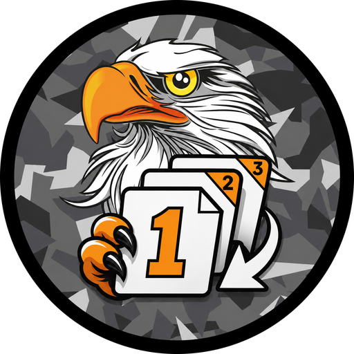

<p align="center">
  
</p>

<h1 align="center">IntelMaker</h1>

Google Presentation → `in1.paa`, `in2.paa`, `in3.paa` … straight into a mission folder.

Paste the share link, pick the mission's `intel` folder, press the button. It downloads
every slide, names them `in1.png`, `in2.png`, …, resizes them to a power-of-two texture
size and runs them through the Arma 3 Tools converter.

## Setup (once)

1. Install Python 3 from [python.org](https://www.python.org/downloads/) (tick *Add Python to PATH*).
2. Double-click **`install-requirements.bat`**.
3. Double-click **`IntelMaker.bat`**. The Arma 3 Tools folder is auto-detected; if the line
   under *Arma 3 Tools* is red, click **Browse…** and pick your `Arma 3 Tools` folder.

Settings (tools path, last folder, prefix, size, recent links) are remembered in
`settings.json` next to the script.

## Using the GUI

| Field | What it does |
|---|---|
| **Presentation link** | The Google Slides URL, or just the presentation ID. Recent links are kept in the dropdown. |
| **Output folder** | Where the `.paa` files land, e.g. `…\missions\New Base V1.tem_kujari\images\BR\intel`. Created if missing. |
| **Prefix / Start at** | `in` + `1` → `in1.paa`, `in2.paa`, … Change to `brief`/`0` if you like. |
| **Long edge** | Texture size. `2048` is the sensible default; `1024` for lighter missions. |
| **Fit** | `stretch` (default), `pad` (letterbox, keeps aspect), or `none`. |
| **Keep the .png files as well** | Off by default — only the `.paa` files are left behind. |
| **Delete existing prefix+number files first** | Clears old `in1…inN` before writing. Asks for confirmation. |
| **Converter** | `ImageToPAA` (default) or `TexView2` (uses `Pal2PacE.exe`). |

> **The presentation must be shared.** In Google Slides: *Share → General access → Anyone
> with the link → Viewer*. Otherwise the download is refused and IntelMaker says so.

## Using the command line

```bash
intel.bat "https://docs.google.com/presentation/d/PRESENTATION_ID/edit?usp=sharing" "C:\path\to\images\BR\intel"
```

Options:

```
--prefix in        file name prefix           --keep-png          keep the .png files too
--start 1          first number               --clean             delete old <prefix><n> files first
--size 2048        power-of-two long edge     --converter TexView2
--mode stretch     stretch | pad | none       --arma-tools "E:\...\Arma 3 Tools"
--pad-color #000   pad colour for pad mode    --save-settings     make these the new defaults
```

Run `intel.bat --help` for the full list, or `IntelMaker.bat` for the GUI.

## Two things worth knowing

**Power-of-two is mandatory.** `ImageToPAA` rejects anything else outright
(`Error (Img is not of power of 2 size)`), so IntelMaker always resizes. A 16:9 deck
becomes 2048×1024, which Arma stretches back to 16:9 in the briefing — this is what most
mission makers do. If you would rather keep exact proportions, pick **pad** and it
letterboxes onto the power-of-two canvas instead.

**Percent signs in paths are left alone.** Arma's *Other Profiles* folders are genuinely
named `CPT%20W%2e%20Fosse` on disk, so a pasted path is used exactly as typed. Only if
that literal path does not exist does IntelMaker try the URL-decoded version, for paths
copied out of a browser.

## Using them in a mission

```sqf
player createDiaryRecord ["Diary", ["Intel", ""]];
```

Re-run IntelMaker after editing the slides and the images update in place — the file names
stay the same, so nothing in the mission needs touching. Tick **Delete existing** if the
deck got shorter, so stale high-numbered images do not linger.

## Troubleshooting

| Message | Fix |
|---|---|
| *Google refused the download* | Set sharing to "Anyone with the link". |
| *Converter not found* | Point the Arma 3 Tools box at the folder containing `ImageToPAA\`. |
| *Img is not of power of 2 size* | You set **Fit** to `none`. Use `stretch` or `pad`. |
| `ModuleNotFoundError` | Run `install-requirements.bat`. |
