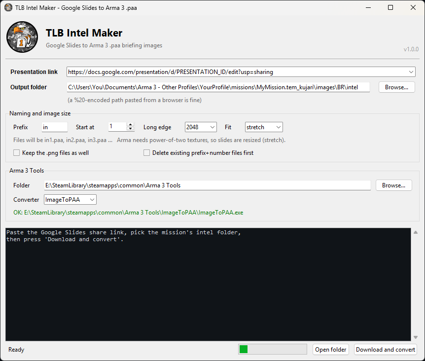

<p align="center">
  
</p>

<h1 align="center">TLB Intel Maker</h1>

Google Presentation → `in1.paa`, `in2.paa`, `in3.paa` … straight into a mission folder.

Paste the share link, pick the mission's `intel` folder, press the button. It downloads
every slide, names them `in1.png`, `in2.png`, …, resizes them to a power-of-two texture
size and runs them through the Arma 3 Tools converter.

<p align="center">
  
</p>

## What you can use it for

Anything in Arma that displays an image. Write it as slides in Google Slides, where
you already have templates, fonts, images and everyone editing the same deck. Then pull
it straight into the mission as textures.

- **Mission briefings**. Diary records, orders and target packets.
- **Training slides**. A whole classroom deck, in-game.
- **ACE slideshows**. Point the module's image list at the `.paa` files.
- **1TROOP slideshows**. Same idea, same files.
- **Anything else**. Loading screens, menu backgrounds, static images on a billboard,
  or your own slide script.

The tool has no opinion about what you do with the output. All it does is fetch each
slide from Google and turn it into a `.paa`, named in order. Wiring those images into
a briefing, a module or a script is the same job it always was.

## Get your slide size right first

This is the one thing worth doing before you write a single slide, and it takes ten
seconds.

Arma's engine requires texture dimensions that are **powers of two**, such as 512,
1024 or 2048. For briefing images and loading screens, **2048 × 1024** is the sweet spot,
with **1024 × 512** for lighter missions. `ImageToPAA` refuses anything else outright,
so TLB Intel Maker always resizes to fit; the question is only whether that resize
distorts your slides.

In Google Slides: **File → Page setup → Custom**, switch the units to **Pixels**, and
enter `2048 × 1024`.

What actually matters is the **aspect ratio**, not the exact pixel count, because the
tool re-renders each slide at full resolution anyway. A 2048 × 1024 deck is 2:1, matches
the texture exactly and comes through pixel-perfect. Leave it on the default 16:9 and
your slides get squeezed about 11% vertically to reach 2:1. Arma stretches them back
out in the briefing, so it usually passes unnoticed, but circles become ovals if you
look closely. Set the page size up front and the problem never exists.

If you are stuck with a deck you cannot re-size, switch **Fit** to `pad`. That
letterboxes the slide onto the power-of-two canvas with bars instead of stretching it.

## Install

### The easy way, no Python needed

Download **`TLB Intel Maker.exe`** from the
[Releases page](https://github.com/TLB-MilSim/Google-Slides-to-paa/releases) and run it.
That is the entire install: Python and every library are bundled inside.

Put it in a folder of its own if you like, and run `setup.bat` next to it to get Desktop
and Start Menu shortcuts. `intel.exe` in the same release is the command-line version.

### From source

1. Install Python 3 from [python.org](https://www.python.org/downloads/) (tick *Add Python to PATH*).
2. Double-click **`setup.bat`**. It installs the packages and creates the shortcuts.

Either way, the Arma 3 Tools folder is auto-detected on first run. If the line under
*Arma 3 Tools* is red, click **Browse…** and pick your `Arma 3 Tools` folder.

Settings (tools path, last folder, prefix, size, recent links) are remembered in
`settings.json`, next to the script or next to the `.exe`.

## Using the GUI

| Field | What it does |
|---|---|
| **Presentation link** | The Google Slides URL, or just the presentation ID. Recent links are kept in the dropdown. |
| **Output folder** | Where the `.paa` files land, e.g. `…\missions\New Base V1.tem_kujari\images\BR\intel`. Created if missing. |
| **Prefix / Start at** | `in` + `1` → `in1.paa`, `in2.paa`, … Change to `brief`/`0` if you like. |
| **Long edge** | Texture size. `2048` is the sensible default; `1024` for lighter missions. |
| **Fit** | `stretch` (default), `pad` (letterbox, keeps aspect), or `none`. |
| **Keep the .png files as well** | Off by default. Only the `.paa` files are left behind. |
| **Delete existing prefix+number files first** | Clears old `in1…inN` before writing. Asks for confirmation. |
| **Converter** | `ImageToPAA` (default) or `TexView2` (uses `Pal2PacE.exe`). |

> **The presentation must be shared.** In Google Slides: *Share → General access → Anyone
> with the link → Viewer*. Otherwise the download is refused and TLB Intel Maker says so.

## Using the command line

```bash
intel.bat "https://docs.google.com/presentation/d/PRESENTATION_ID/edit?usp=sharing" "C:\path\to\images\BR\intel"
```

Options:

```
--prefix in        file name prefix           --keep-png          keep the .png files too
--start 1          first number               --clean             delete old <prefix><n> files first
--size 2048        power-of-two long edge     --converter TexView2
--mode stretch     stretch | pad | none       --arma-tools "E:\...\Arma 3 Tools"
--pad-color #000   pad colour for pad mode    --save-settings     make these the new defaults
```

Run `intel.bat --help` for the full list, or `TLB Intel Maker.bat` for the GUI.

## One quirk worth knowing

**Percent signs in paths are left alone.** Arma's *Other Profiles* folders are genuinely
named `CPT%20W%2e%20Fosse` on disk, so a pasted path is used exactly as typed. Only if
that literal path does not exist does TLB Intel Maker try the URL-decoded version, for
paths copied out of a browser address bar.

## Using them in a mission

In a briefing:

```sqf
player createDiaryRecord ["Diary", ["Intel", ""]];
```

For an ACE or 1TROOP slideshow, give the module the same files in order,
`images\BR\intel\in1.paa`, `in2.paa`, `in3.paa`, and the deck plays through as slides.

Re-run TLB Intel Maker after editing the presentation and the images update in place.
The file names never change, so nothing in the mission has to be touched. Tick
**Delete existing** if the deck got shorter, so stale high-numbered images do not linger.

## Troubleshooting

| Message | Fix |
|---|---|
| *Google refused the download* | Set sharing to "Anyone with the link". |
| *Converter not found* | Point the Arma 3 Tools box at the folder containing `ImageToPAA\`. |
| *Img is not of power of 2 size* | You set **Fit** to `none`. Use `stretch` or `pad`. |
| `ModuleNotFoundError` | Run `setup.bat`, or use the `.exe` from Releases instead. |
| Windows SmartScreen warning | The `.exe` is unsigned. *More info → Run anyway*. |

## Building the executables

Maintainers only. Users download the `.exe` from Releases.

Run `build.bat`. It installs PyInstaller and produces `dist\TLB Intel Maker.exe` (windowed)
and `dist\intel.exe` (console), each about 41 MB with everything bundled.

Two flags in there are load-bearing. `requests`, `pymupdf` and `PIL` are imported
dynamically by `require()` so PyInstaller cannot see them, hence the explicit
`--hidden-import` for each; keep those in step with `requirements.txt`. The
`--exclude-module` list drops PyMuPDF's optional table-extraction stack (scipy, pandas,
numpy, sqlalchemy), which is unused here and otherwise takes the build from 41 MB to
99 MB.
